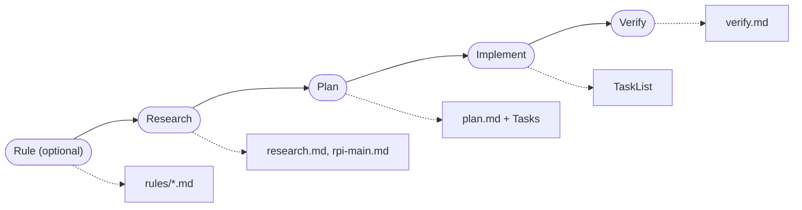
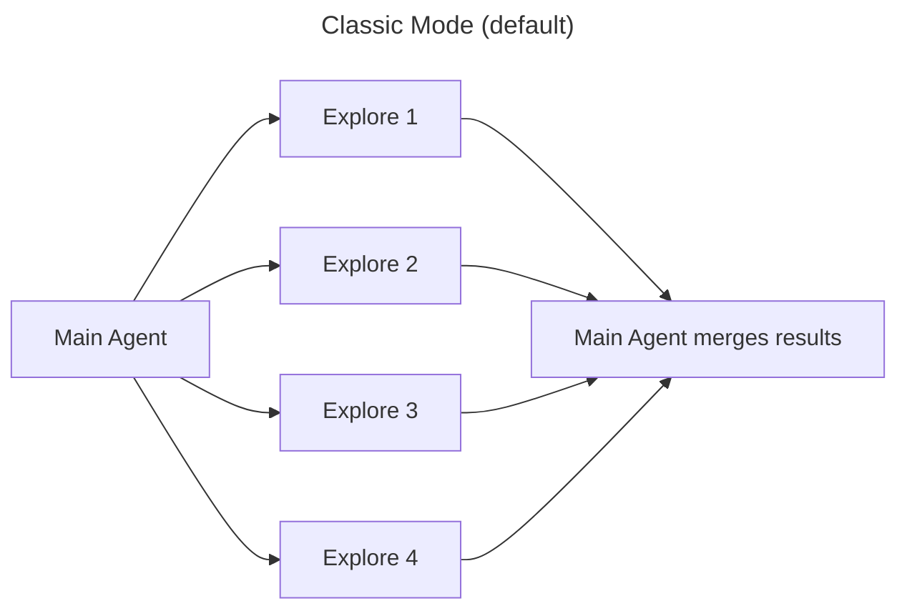
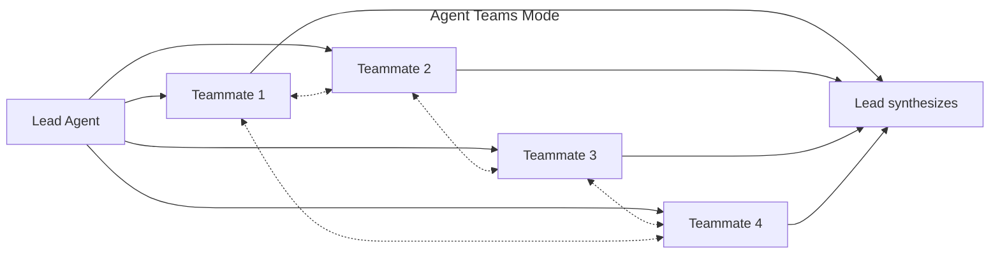
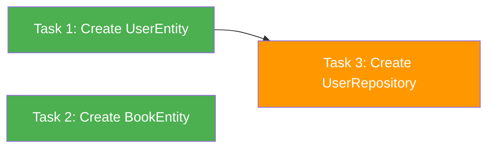

# RPI Workflow

**Research → Plan → Implement**: A structured workflow for Claude Code that manages context efficiently across complex coding tasks.

## Why RPI?

When working with AI coding assistants on large tasks, you often hit context limits mid-implementation. RPI solves this by:

- **Separating concerns**: Each phase has a clear goal and output
- **Preserving context**: Documents carry knowledge between sessions
- **Enabling parallelism**: Research uses 4 parallel agents (or Agent Teams for cross-communication); Implementation uses parallel Sub-Agents
- **Tracking progress**: Claude Tasks persist across `/clear` commands

## When to Use RPI

### Best for Brownfield Projects

RPI shines when working with **existing codebases**:

- Adding features to mature projects
- Bug fixes requiring deep context understanding
- Refactoring with safety guarantees
- Any task where understanding existing code is as important as writing new code

The Research phase deploys **4 parallel Explore Agents** to thoroughly understand your codebase before making changes. This "understand first, change safely" approach is what makes RPI ideal for brownfield development.

### For Greenfield Projects?

For brand new projects with no existing code:
- Transition to RPI once your codebase has foundational structure (entities, core modules, basic patterns)

**Rule of thumb**: If there's code worth researching, RPI is the right choice.

## Workflow Overview



### Setup: Rule (`/rpi:rule`) - Optional

Define project-specific rules to guide Research agents:
- **architecture**: Layer structure, module patterns
- **patterns**: Code style, naming conventions
- **dependencies**: DI patterns, module boundaries
- **testing**: Test framework, mocking patterns

**Output**: `<project>/.claude/rules/[type].md`

### Phase 1: Research (`/rpi:research`)

Launches 4 agents to investigate (supports two execution modes):

| Mode | When | How |
|------|------|-----|
| **Agent Teams** | `CLAUDE_CODE_EXPERIMENTAL_AGENT_TEAMS=1` | 4 Teammates with direct cross-communication |
| **Classic** | Default | 4 parallel Explore agents (independent) |

Agents/Teammates explore:
- **Architecture**: Project structure, layer patterns
- **Similar Features**: Reference implementations to follow
- **Dependencies**: Impact scope and affected files
- **Test Structure**: Testing conventions and patterns

**Output**: `research.md` + `rpi-main.md`

### Phase 2: Plan (`/rpi:plan`)

Creates implementation plan with:
- Batched steps grouped by complexity
- Claude Tasks for progress tracking
- Parallel vs sequential task dependencies

**Output**: `plan.md` + Claude Tasks registered

### Phase 3: Implement (`/rpi:implement`)

Executes tasks via Sub-Agents:
- Parallel execution for independent tasks
- Context checkpoints at batch boundaries
- Seamless session resume via TaskList

**Output**: Working code with tracked progress

### Phase 4: Verify (`/rpi:verify`)

Validates implementation completeness:
- **Build verification**: Auto-detects project type (Swift, Node, Rust, Go, etc.)
- **Test verification**: Runs project test suite
- **Plan check**: Compares implementation against plan.md

**Output**: `verify.md` (report) - Creates fix tasks if issues found

## Installation

### Plugin Install (Recommended)

```bash
# 1. Add the RPI Workflow marketplace
/plugin marketplace add ValseLee/RPIWorkflow

# 2. Install the plugin
/plugin install rpi@rpi-workflow
```

The plugin install automatically:
- Registers all RPI commands (`/rpi:research`, `/rpi:plan`, `/rpi:implement`, `/rpi:verify`, `/rpi:rule`)
- Sets up session management hooks
- Manages templates and configurations

To update later:
```bash
/plugin marketplace update
```

### Manual Install (Legacy)

For backward compatibility or custom setups:

```bash
# Clone the repository
git clone https://github.com/ValseLee/RPIWorkflow.git
cd RPIWorkflow

# Run install script
./install.sh
```

**Manual setup steps:**

1. Copy commands to Claude Code commands directory:
```bash
mkdir -p ~/.claude/commands/rpi
cp commands/*.md ~/.claude/commands/rpi/
```

2. Copy templates:
```bash
mkdir -p ~/.claude/rpi
cp templates/*.md ~/.claude/rpi/
```

3. Restart Claude Code or start a new session.

## Usage

> **Note**: All commands use the `/rpi:` namespace regardless of installation method (plugin or manual).

### Starting a New Feature

```bash
# 0. (Optional) Setup project rules first time
/rpi:rule add architecture
/rpi:rule add testing

# 1. Research phase
/rpi:research
# "Start RPI research for [feature]"

# 2. After research completes
/clear

# 3. Plan phase
/rpi:plan
# "Create plan based on @docs/research/[branch]/...-research.md"

# 4. After plan approval (Task List ID auto-assigned)
/clear

# 5. Implement phase
/rpi:implement
# "Check TaskList and start implementation"

# 6. After all tasks complete
/rpi:verify
# Validates build, tests, and plan implementation
```

### Resuming Work

```bash
# After /clear or new session
/rpi:implement
# "Resume RPI from @docs/rpi/[branch]/rpi-main.md"
```

### Context Management

When context usage exceeds 40% (check Status Line):
1. Complete current batch
2. Run `/clear`
3. Resume with `/rpi:implement`
4. TaskList automatically shows progress

## Project Structure

### Plugin Structure (Recommended)

```
RPIWorkflow/                # Plugin repository
├── .claude-plugin/
│   ├── plugin.json         # Plugin manifest
│   └── marketplace.json    # Marketplace metadata
├── commands/               # Command definitions
│   ├── research.md         # /rpi:research
│   ├── plan.md             # /rpi:plan
│   ├── implement.md        # /rpi:implement
│   ├── verify.md           # /rpi:verify
│   └── rule.md             # /rpi:rule
├── hooks/
│   ├── hooks.json          # Hook registration manifest
│   └── session-info.py     # Session management hook
├── templates/              # Document templates
│   ├── rpi-main-template.md
│   ├── research-template.md
│   ├── plan-template.md
│   ├── verify-template.md
│   ├── rule-template.md
│   └── rules/              # Example rule files
│       ├── architecture-example.md
│       ├── dependencies-example.md
│       ├── patterns-example.md
│       └── testing-example.md
├── examples/
│   └── examples.md
├── install.sh              # Legacy manual install
├── uninstall.sh            # Legacy manual uninstall
├── CONTRIBUTING.md
├── LICENSE
└── README.md

your-project/
├── .claude/rules/          # Project-specific rules (optional)
│   ├── architecture.md
│   ├── patterns.md
│   ├── dependencies.md
│   └── testing.md
└── docs/
    ├── research/[branch]/  # Research outputs
    ├── plans/[branch]/     # Plan documents
    ├── verify/[branch]/    # Verification reports
    └── rpi/[branch]/       # RPI status tracking
```

### Manual Install Structure (Legacy)

```
~/.claude/
├── commands/rpi/          # Slash commands
│   ├── research.md        # /rpi:research
│   ├── plan.md            # /rpi:plan
│   ├── implement.md       # /rpi:implement
│   ├── verify.md          # /rpi:verify
│   └── rule.md            # /rpi:rule
├── hooks/rpi/             # Hook scripts
│   └── session-info.py    # Session management
└── rpi/                   # Templates
    ├── rpi-main-template.md
    ├── research-template.md
    ├── plan-template.md
    ├── verify-template.md
    └── rule-template.md
```

## Key Concepts

### Agent Teams Mode (Experimental)

Research phase supports [Claude Code Agent Teams](https://code.claude.com/docs/en/agent-teams) for enhanced codebase exploration. In Agent Teams mode, the 4 research agents become **Teammates** that can communicate directly with each other, enabling real-time cross-referencing of findings.

**Enable per project:**
```json
// .claude/settings.local.json
{
  "env": {
    "CLAUDE_CODE_EXPERIMENTAL_AGENT_TEAMS": "1"
  }
}
```

**Classic vs Agent Teams:**





Key advantages:
- Architecture Teammate shares structural findings early, so other Teammates focus their search
- Similar Feature Teammate shares reference paths with Dependency Teammate for accurate impact mapping
- Lead Agent context stays clean (no 4-result merge burden)

Remove the env var or set to `0` to revert to Classic mode.

### Project Rules

Rules provide project-specific context to Research agents. Each rule type guides a specific Explore Agent:

| Rule Type | Agent | Example Content |
|-----------|-------|-----------------|
| `architecture` | Architecture | Layer structure, module patterns |
| `patterns` | Similar Feature | Code style, naming conventions |
| `dependencies` | Dependency | DI patterns, module boundaries |
| `testing` | Test Structure | Test framework, mocking patterns |

**Managing rules:**
```bash
# Add a rule
/rpi:rule add architecture

# List rules for current project
/rpi:rule list

# Remove a rule
/rpi:rule remove testing
```

Rules are stored in `<project>/.claude/rules/[type].md` and automatically loaded during `/rpi:research`.

### Batching

Tasks are grouped by complexity:
| Complexity | Batch Size | Example |
|------------|------------|---------|
| High (new architecture) | 2-3 tasks | Entity + Repository + UseCase |
| Medium (modify existing) | 4-5 tasks | Mapper + DI + ViewModel |
| Low (simple changes) | 5-7 tasks | imports, type fixes |

### Parallel Execution

Tasks without dependencies run in parallel:


> Task 1, 2: parallel / Task 3: blockedBy [1]

### Task Persistence

Task List ID is **automatically assigned** during the Plan phase and saved to `.claude/settings.local.json`. Tasks persist across `/clear` commands without manual intervention.

**How it works**:
1. Plan phase generates ID from research filename (format: `YYYY-MM-DD-[feature-name]`)
2. ID is saved to `.claude/settings.local.json` → `env.CLAUDE_CODE_TASK_LIST_ID`
3. Session management hook guards the ID across sessions

No manual `export` needed — just run `/clear` and resume with `/rpi:implement`.

### Session Management Hook

RPI includes a `session-info.py` hook (`UserPromptSubmit`) that runs on every prompt to manage Task List ID persistence automatically.

**Key features**:
- **Auto-save**: When tasks exist for the current session, saves session ID to `.claude/settings.local.json`
- **RPI format guard**: Preserves RPI-format IDs (`YYYY-MM-DD-*`) — won't overwrite with UUID session IDs
- **Session info trigger**: Type `<session info>`, `<this session>`, or `<rpi session>` to view current session status and task verification

The hook is registered via `hooks/hooks.json` and installed automatically with the plugin.

## Examples

See [examples/](./examples/) for detailed conversation examples:
- Bug fix workflow
- New feature implementation
- Refactoring existing code
- Session recovery

## Roadmap

- **Agent Teams for Implement phase**: Extend Agent Teams mode beyond Research to enable Teammate-based parallel implementation with real-time coordination. Paired with git worktree isolation to eliminate file write conflicts between parallel agents.
- **Git worktree integration**: Each parallel Teammate works in an isolated worktree, merged back after completion. Enables safe parallel writes even on interdependent tasks.

## Requirements

- [Claude Code](https://claude.ai/code) CLI
- Git (for version control)
- Python 3.7+ (for session management hook)
- jq (optional, used by `install.sh` for hook registration)

## Troubleshooting

### Tasks not persisting after `/clear`

- Verify Task List ID is saved: type `<session info>` to check
- Ensure you're on the same branch — Task List ID is per-project
- Check `.claude/settings.local.json` has `CLAUDE_CODE_TASK_LIST_ID` in `env`

### Hook not running

- Verify `hooks/hooks.json` is registered: check `~/.claude/settings.json` or project `.claude/settings.local.json` for hook paths
- Run `python3 hooks/session-info.py` manually to check for Python errors
- Ensure Python 3.7+ is installed

### Context overflow during implementation

- Check context usage in the Status Line
- Run `/clear` when usage exceeds 40%
- Resume with `/rpi:implement` — TaskList persists automatically

### Plugin install issues

- Update marketplace: `/plugin marketplace update`
- Verify plugin name: `rpi@rpi-workflow`
- Fallback: use manual install method (see Installation section)

## Contributing

Contributions are welcome! Please read [CONTRIBUTING.md](./CONTRIBUTING.md) for guidelines.

## License

MIT License - see [LICENSE](./LICENSE) for details.
