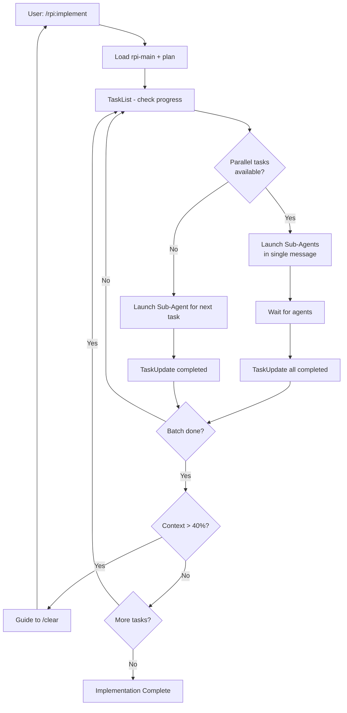

# RPI Implement Phase

## Overview

Implement is the third phase of the RPI workflow. Execute Tasks via Sub-Agents, leveraging parallel execution for independent tasks.

**Goal**: Execute the plan efficiently while managing context window.

## Prerequisites

- Plan phase must be complete
- Tasks must be created (TaskList should show them)
- `CLAUDE_CODE_TASK_LIST_ID` should be set (for session persistence)

## Rule Loading (Optional)

If your project has rule documents, load relevant ones based on task content:
- Testing rules - For TDD guidance
- Component rules - For specific patterns (views, services, etc.)
- Commit rules - When creating commits

> Note: Rule documents are project-specific. Skip if not available.

## Input

- `@docs/rpi/[branch]/rpi-main.md` (status check)
- `@docs/research/[branch]/...-research.md`
- `@docs/plans/[branch]/...-plan.md`
- **`TaskList`** (primary progress tracking)

## Sub-Agent Execution Policy

### Default: Use Sub-Agents

For most tasks, launch Sub-Agents via Task tool:

- Keeps main context clean for orchestration
- Enables true parallel execution
- Prevents context bloat from implementation details

### Exception: Trivial Tasks (Direct Execution Allowed)

You MAY execute directly in main context when ALL of these apply:

| Criteria | Example |
|----------|---------|
| Single file change | One config file update |
| < 5 lines modified | Adding an import statement |
| No logic changes | Renaming, fixing typos |
| No test required | Config, comments, formatting |

**Trivial task examples:**
- Adding a single import statement
- Fixing a typo in a string
- Updating a version number in config
- Adding a comment or documentation line

**NOT trivial (must use Sub-Agent):**
- Any new function or method
- Any logic change
- Multiple file modifications
- Changes requiring tests

### Anti-pattern (DO NOT DO THIS for non-trivial tasks)

```
# WRONG - Direct execution for complex task
TaskUpdate [id] status: in_progress
Write(file_path="...", content="...")  # <- Complex task, should use Sub-Agent
TaskUpdate [id] status: completed
```

## Workflow



## Task Execution

### Sequential Execution (dependent tasks)

```
1. TaskList - see all tasks and their status
2. TaskGet [id] - get next pending task details
3. TaskUpdate [id] status: in_progress
4. Launch Sub-Agent via Task tool:
   Task(subagent_type="general-purpose", prompt="Execute Task #[id]: ...")
5. Wait for agent completion
6. Verify result, then TaskUpdate [id] status: completed
7. Repeat for next task
```

### Parallel Execution (tasks with NO blockedBy)

```
1. TaskList - identify ALL tasks with empty blockedBy
2. Launch ALL parallel tasks in ONE message:

   [Single message containing multiple Task tool calls]
   Task(subagent_type="general-purpose", description="Task 1", prompt="...")
   Task(subagent_type="general-purpose", description="Task 2", prompt="...")
   Task(subagent_type="general-purpose", description="Task 3", prompt="...")

3. Wait for ALL agents to complete
4. TaskUpdate each as completed
5. Check TaskList for newly unblocked tasks
6. Repeat until all tasks complete
```

## Sub-Agent Prompt Template

```
Execute RPI Task [id]: [subject]

Context:
- Plan: @docs/plans/[branch]/...-plan.md
- Research: @docs/research/[branch]/...-research.md

Task Details:
[paste from TaskGet description]

Requirements:
1. Follow TDD if applicable - write test first
2. Follow project conventions from research.md
3. Build/lint must pass after changes
4. Report: files changed, tests added, verification result
```

## Context Management

### Compact Trigger

After each Batch completion, ask via `AskUserQuestion`:
> "Batch N complete. Check context usage in Status Line. Over 40%?"

- **Yes** -> Guide to `/clear` -> Next session (Tasks persist!)
- **No** -> Continue to next task

### Session Resume

After `/clear`, if `CLAUDE_CODE_TASK_LIST_ID` was set:
```
1. TaskList - instantly see where you left off
2. Continue from first pending task (check blockedBy)
```

## Exit Conditions

### Batch Complete (Compact needed)

```
Batch N complete.

Completed tasks:
- Task X: [subject] ✓
- Task Y: [subject] ✓

Check context in Status Line. If over 40%, run /clear.
TaskList will persist (CLAUDE_CODE_TASK_LIST_ID is set).

After /clear, run /rpi:implement to continue.
```

### All Tasks Complete

```
Implementation complete!

All N tasks finished:
- Batch 1: [description] ✓
- Batch 2: [description] ✓
- ...

Next steps:
1. Run tests to verify: [test command]
2. Manual testing if needed
3. Create commit when ready
```

## Recovery

### If session was interrupted (env var set):

1. Run `TaskList` - see current progress
2. Find first pending task (status != completed)
3. Check blockedBy - if blocked, find and complete blockers first
4. Continue execution

### If TaskList is empty (env var not set):

**Step 1**: Check rpi-main.md for saved Task List ID
```
Read @docs/rpi/[branch]/rpi-main.md
Look for "Task List ID: [id]"
```

**Step 2**: If ID found, set environment variable
```bash
export CLAUDE_CODE_TASK_LIST_ID="[id from rpi-main.md]"
```

**Step 3**: If ID invalid or not found, recreate tasks
```
1. Read @docs/plans/[branch]/...-plan.md
2. TaskCreate for each Step in the plan
3. TaskUpdate to set dependencies (blockedBy)
4. Mark already-completed tasks (check git diff or file existence)
5. Save new Task List ID to rpi-main.md
6. export CLAUDE_CODE_TASK_LIST_ID="[new_id]"
```

### Quick Recovery Command

If user provides rpi-main.md reference:
```
@docs/rpi/[branch]/rpi-main.md - check Task List ID and recover progress
```

## Red Flags - STOP

- Using Write/Edit directly for NON-TRIVIAL tasks (use Sub-Agent!)
- Launching parallel tasks in separate messages (must be ONE message)
- Running dependent tasks in parallel (check blockedBy!)
- Parallel tasks modifying same file (will cause conflicts)
- Continuing past 40% context without asking about Compact
- Forgetting to TaskUpdate completed tasks
- Not checking rpi-main.md for Task List ID before recreating tasks
