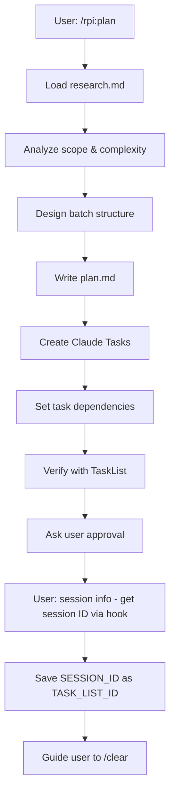

# RPI Plan Phase

## Overview

Plan is the second phase of the RPI workflow. Create a structured implementation plan with batches and register Claude Tasks for tracking.

**Goal**: Design implementation steps and create trackable Tasks before coding.

## Prerequisites

- Research phase must be complete
- `docs/research/[branch]/...-research.md` must exist
- User should have run `/clear` after research

## Rule Loading

No rules to load - reference research.md only (minimize context)

## Input

- `@docs/research/[branch]/...-research.md` (only input needed)

## Workflow



## Batch Design Guidelines

Group tasks by complexity:

| Task Complexity | Batch Size | Example |
|-----------------|-----------|---------|
| High (new files, architecture) | 2-3 tasks | Core modules, schemas |
| Medium (modify existing) | 4-5 tasks | Services, handlers |
| Low (simple changes) | 5-7 tasks | Imports, config changes |

### Typical Batch Order

1. **Core/Domain** - Entities, interfaces, types (high complexity)
2. **Data/Infrastructure** - Models, repositories, services (medium)
3. **Presentation/API** - Controllers, views, routes (medium)
4. **Integration** - Wiring, configuration (low)
5. **Tests** - Unit tests, integration tests (varies)

## Task Registration

After plan.md is written, register each Step as a Claude Task:

```
TaskCreate for each Step:
- subject: "Step N: [Step Name]"
- description: |
    File: path/to/file
    Action: Create | Modify | Delete
    Changes: [description]
    Verification: [how to verify]
- activeForm: "Implementing [Step Name]"
- metadata: { "parallel": true/false, "batch": N }

TaskUpdate for dependencies:
- Dependent tasks → addBlockedBy: [prerequisite task IDs]
- Independent tasks within batch → no blockedBy (parallel eligible)
```

### Parallel vs Sequential

| Condition | Parallel? | blockedBy |
|-----------|-----------|-----------|
| Different files, no shared types | Yes | empty |
| Same file | No | previous task |
| Uses type from another task | No | that task |
| Independent tests | Yes | empty |

### Example

```
Batch 1: Core Layer
- Task 1: "Create User model" parallel:Yes (no blockedBy)
- Task 2: "Create Product model" parallel:Yes (no blockedBy)
- Task 3: "Create UserRepository interface" blockedBy:[1]

Tasks 1,2 can run in parallel via Sub-Agents
Task 3 waits for Task 1
```

## Output Files

### 1. plan.md

Location: `docs/plans/[branch-name]/YYYY-MM-DD-[feature]-plan.md`

Use template: `~/.claude/rpi/plan-template.md`

Must include:
- Objective
- Prerequisites
- Batch structure with Steps
- Each Step: File, Action, Changes, Verification
- Batch checkpoints
- Test plan
- Risk assessment
- Task registration section

### 2. Update rpi-main.md

Update with:
- Plan document: Approved
- Session ID: [from session info hook]
- Current Session: Implement

## Session ID as Task List ID (CRITICAL)

<CRITICAL>
Task list persistence requires the session ID. Use the RPI session hook to retrieve it.

### Step 1: Retrieve Session ID

Ask the user to type one of these trigger keywords:
- `<session info>`
- `<this session>`
- `<rpi session>`

The hook will inject the current session ID into the conversation context.

### Step 2: Save Session ID

Save the session ID to `.claude/settings.local.json`:

```json
{
  "env": {
    "CLAUDE_CODE_TASK_LIST_ID": "[session_id from hook]"
  }
}
```

**Note**: If the file already exists, merge with existing content.

### Step 3: Record Backup

Also record the session ID in:
- **rpi-main.md** - `Session ID: [id]`
- **plan.md footer** - For reference

**Without saving the ID, Tasks will be lost on /clear!**
</CRITICAL>

### Hook Not Installed?

If the session info hook is not installed:

1. **Run RPI installer** - `./install.sh` from RPIWorkflow directory
2. **Add hook to settings.json** (global `~/.claude/settings.json`):
   ```json
   {
     "hooks": {
       "UserPromptSubmit": [
         {
           "type": "command",
           "command": "~/.claude/hooks/rpi/session-info.py"
         }
       ]
     }
   }
   ```
3. **Restart Claude Code** to load hooks

### Fallback: Recovery without Session ID

If session ID was not saved or is invalid:

1. **Check rpi-main.md** - Session ID may be recorded there
2. **Recreate tasks from plan.md**:
   ```
   1. Read plan.md
   2. TaskCreate for each Step
   3. TaskUpdate to set dependencies
   4. Retrieve new session ID with <session info>
   5. Save to settings.local.json and rpi-main.md
   ```

### Persistence Points

Always record Session ID in these locations:
1. **`.claude/settings.local.json`** - Primary (auto-loaded as CLAUDE_CODE_TASK_LIST_ID)
2. **rpi-main.md** - Backup (for recovery)
3. **plan.md footer** - Reference (for documentation)

## Exit Conditions

Before guiding user to `/clear`:

- [ ] plan.md complete with batch structure
- [ ] All Steps have TaskCreate called
- [ ] Dependencies set via TaskUpdate
- [ ] User approved the plan
- [ ] User typed `<session info>` to retrieve session ID
- [ ] Session ID saved to `.claude/settings.local.json` as `CLAUDE_CODE_TASK_LIST_ID`
- [ ] Session ID recorded in rpi-main.md (backup)
- [ ] Session ID appended to plan.md footer (reference)

## Exit Message Template

**IMPORTANT**: The session ID is retrieved via the `<session info>` hook trigger.

```
Plan phase complete.

Documents:
- `docs/plans/[branch]/[date]-[feature]-plan.md`
- Updated `docs/rpi/[branch]/rpi-main.md`
- Updated `.claude/settings.local.json` with Session ID

Tasks created: N tasks across M batches
Session ID: [session-id-from-hook]

Next steps:
1. Run `/clear` to start fresh session
2. Run `/rpi:implement` to start implementation
```

**Note**: Session ID saved as `CLAUDE_CODE_TASK_LIST_ID` is automatically loaded on next session.

## Approval Flow

Use `AskUserQuestion` to get approval:
- Present plan summary
- Show batch structure
- List total tasks and parallel opportunities
- Ask for approval

## Red Flags - STOP

- Planning without research.md
- Creating tasks without dependencies analysis
- Skipping TaskCreate for any Step
- Forgetting to retrieve session ID via `<session info>`
- Not saving session ID to settings.local.json
- Not getting user approval before proceeding
