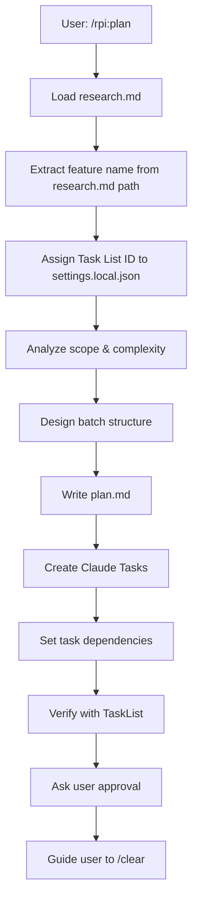

# RPI Plan Phase

## Overview

Plan is the second phase of the RPI workflow. Create a structured implementation plan with batches and register Claude Tasks for tracking.

**Goal**: Design implementation steps and create trackable Tasks before coding.

## Prerequisites

- Research phase must be complete
- `docs/research/[branch]/...-research.md` must exist
- User should have run `/clear` after research

## Rule Loading

No rules to load - reference research.md only (minimize context)

## Input

- `@docs/research/[branch]/...-research.md` (only input needed)

## Workflow



## Batch Design Guidelines

Group tasks by complexity:

| Task Complexity | Batch Size | Example |
|-----------------|-----------|---------|
| High (new files, architecture) | 2-3 tasks | Core modules, schemas |
| Medium (modify existing) | 4-5 tasks | Services, handlers |
| Low (simple changes) | 5-7 tasks | Imports, config changes |

### Typical Batch Order

1. **Core/Domain** - Entities, interfaces, types (high complexity)
2. **Data/Infrastructure** - Models, repositories, services (medium)
3. **Presentation/API** - Controllers, views, routes (medium)
4. **Integration** - Wiring, configuration (low)
5. **Tests** - Unit tests, integration tests (varies)

## Task Registration

After plan.md is written, register each Step as a Claude Task:

```
TaskCreate for each Step:
- subject: "Step N: [Step Name]"
- description: |
    File: path/to/file
    Action: Create | Modify | Delete
    Changes: [description]
    Verification: [how to verify]
- activeForm: "Implementing [Step Name]"
- metadata: { "parallel": true/false, "batch": N }

TaskUpdate for dependencies:
- Dependent tasks → addBlockedBy: [prerequisite task IDs]
- Independent tasks within batch → no blockedBy (parallel eligible)
```

### Parallel vs Sequential

| Condition | Parallel? | blockedBy |
|-----------|-----------|-----------|
| Different files, no shared types | Yes | empty |
| Same file | No | previous task |
| Uses type from another task | No | that task |
| Independent tests | Yes | empty |

### Example

```
Batch 1: Core Layer
- Task 1: "Create User model" parallel:Yes (no blockedBy)
- Task 2: "Create Product model" parallel:Yes (no blockedBy)
- Task 3: "Create UserRepository interface" blockedBy:[1]

Tasks 1,2 can run in parallel via Sub-Agents
Task 3 waits for Task 1
```

## Output Files

### 1. plan.md

Location: `docs/plans/[branch-name]/YYYY-MM-DD-[feature]-plan.md`

Use template: `templates/plan-template.md`

Must include:
- Objective
- Prerequisites
- Batch structure with Steps
- Each Step: File, Action, Changes, Verification
- Batch checkpoints
- Test plan
- Risk assessment
- Task registration section

### 2. Update rpi-main.md

Update with:
- Plan document: Approved
- Task List ID: [auto-assigned]
- Current Session: Implement

## Task List ID Auto-Assign

Plan phase automatically assigns a Task List ID **before** creating Tasks.

### ID Format

`YYYY-MM-DD-[feature-name]`

- Date: from research.md filename
- Feature name: from research.md filename (date and `-research.md` removed)
- Example: `2026-02-10-task-list-id-auto-assign`

### How It Works

1. Extract feature name from research.md path:
   - Input: `docs/research/main/2026-02-10-task-list-id-auto-assign-research.md`
   - Extract: `2026-02-10-task-list-id-auto-assign`

2. Write to `.claude/settings.local.json`:
   ```json
   {
     "env": {
       "CLAUDE_CODE_TASK_LIST_ID": "2026-02-10-task-list-id-auto-assign"
     }
   }
   ```
   Use Read to check existing settings, merge `env` key, Write back.

3. Record in rpi-main.md and plan.md footer.

4. Proceed with TaskCreate (Tasks will use the assigned ID).

### Fallback

If research.md path is not provided or filename cannot be parsed:
- Ask user for feature name via AskUserQuestion
- Generate ID as `YYYY-MM-DD-[user-provided-name]` (today's date)

## Exit Conditions

Before guiding user to `/clear`:

- [ ] plan.md complete with batch structure
- [ ] All Steps have TaskCreate called
- [ ] Dependencies set via TaskUpdate
- [ ] User approved the plan
- [ ] Task List ID auto-assigned to settings.local.json
- [ ] Task List ID recorded in rpi-main.md
- [ ] Task List ID recorded in plan.md footer

## Exit Message Template

```
Plan phase complete.

Documents:
- `docs/plans/[branch]/[date]-[feature]-plan.md`
- Updated `docs/rpi/[branch]/rpi-main.md`
- Updated `.claude/settings.local.json` with Task List ID

Tasks created: N tasks across M batches
Task List ID: [YYYY-MM-DD-feature-name]

Next steps:
1. Run `/clear` to start fresh session
2. Run `/rpi:implement` to start implementation
```

**Note**: Task List ID saved as `CLAUDE_CODE_TASK_LIST_ID` is automatically loaded on next session.

## Approval Flow

Use `AskUserQuestion` to get approval:
- Present plan summary
- Show batch structure
- List total tasks and parallel opportunities
- Ask for approval

## Red Flags - STOP

- Planning without research.md
- Creating tasks without dependencies analysis
- Skipping TaskCreate for any Step
- Not auto-assigning Task List ID before TaskCreate
- Forgetting to record Task List ID in rpi-main.md
- Not getting user approval before proceeding
