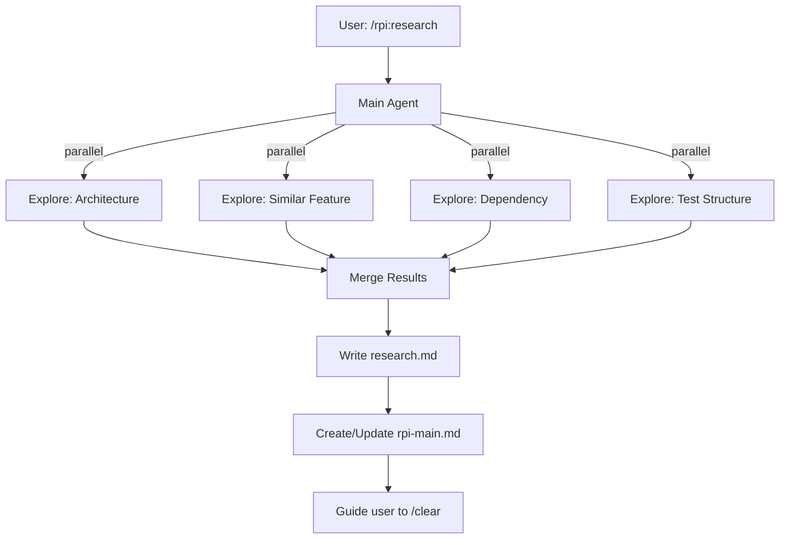

# RPI Research Phase

## Overview

Research is the first phase of the RPI workflow. Run 4 Explore Agents in parallel to gather comprehensive codebase context.

**Goal**: Understand the codebase thoroughly before planning implementation.

## When to Use

- Starting a new feature implementation
- Beginning a bug fix that requires understanding existing code
- Before refactoring work
- When unfamiliar with an area of the codebase

## Rule Loading

Before launching Explore Agents, check for project-specific rules:

```
<project>/.claude/rules/
├── architecture.md   → Architecture Agent
├── patterns.md       → Similar Feature Agent
├── dependencies.md   → Dependency Agent
└── testing.md        → Test Structure Agent
```

**How to load:**
1. Detect project root (git root or current directory)
2. Check if rule file exists at `<project>/.claude/rules/[type].md`
3. If exists, append rule content to agent prompt

**Create rules with:** `/rpi:rule add [type]`

## Workflow



## Parallel Agents

Launch these 4 Explore Agents in a **single message** (critical for parallelism):

| Agent | Role | What to Look For |
|-------|------|------------------|
| Architecture | Project structure, layer patterns | Layers, modules, conventions |
| Similar Feature | Find similar existing code | Reference implementations, patterns to follow |
| Dependency | Track change impact scope | What files will be affected |
| Test Structure | Understand test conventions | Test patterns, naming, frameworks used |

### Agent Prompts

**Architecture Agent:**
```
Explore the codebase architecture for implementing [feature].
Find:
- Layer/module structure
- Key patterns and conventions
- Directory organization
Return: Architecture summary with key file paths

[If .claude/rules/architecture.md exists, append:]
Project Rules:
[rule content]
```

**Similar Feature Agent:**
```
Find existing code similar to [feature].
Look for:
- Similar features already implemented
- Patterns used in comparable functionality
- Reference files to follow
Return: List of reference files with pattern notes

[If .claude/rules/patterns.md exists, append:]
Project Rules:
[rule content]
```

**Dependency Agent:**
```
Analyze dependencies for [feature].
Identify:
- Files that will need modification
- Import chains and dependencies
- Potential impact scope
Return: Affected files list with change types

[If .claude/rules/dependencies.md exists, append:]
Project Rules:
[rule content]
```

**Test Structure Agent:**
```
Analyze test structure for [feature] area.
Find:
- Test file locations and naming
- Testing framework used
- Mock patterns and fixtures
Return: Test patterns with examples

[If .claude/rules/testing.md exists, append:]
Project Rules:
[rule content]
```

## Output Files

### 1. research.md

Location: `docs/research/[branch-name]/YYYY-MM-DD-[feature]-research.md`

Use template: `~/.claude/rpi/research-template.md`

Must include:
- Executive Summary
- Results from all 4 agents
- Relevant files (core + reference)
- Existing patterns
- Dependencies
- Impact analysis
- Constraints discovered
- Open questions

### 2. rpi-main.md

Location: `docs/rpi/[branch-name]/rpi-main.md`

Use template: `~/.claude/rpi/rpi-main-template.md`

Create or update with:
- Current Session: Plan (next phase)
- Research document: Complete
- Session history entry

## Exit Conditions

Before guiding user to `/clear`:

- [ ] research.md complete with all 4 agent outputs
- [ ] rpi-main.md created/updated
- [ ] Open questions listed (if any)
- [ ] User informed about next step: `/clear` then `/rpi:plan`

## Exit Message Template

```
Research phase complete.

Documents created:
- `docs/research/[branch]/[date]-[feature]-research.md`
- `docs/rpi/[branch]/rpi-main.md`

Next steps:
1. Run `/clear` to start fresh session
2. Run `/rpi:plan` with: `@docs/research/[branch]/...-research.md`
```

## Red Flags - STOP

- Attempting to plan without completing research
- Skipping any of the 4 Explore agents
- Not running agents in parallel (must be single message)
- Forgetting to create rpi-main.md
- Not guiding user to `/clear`
