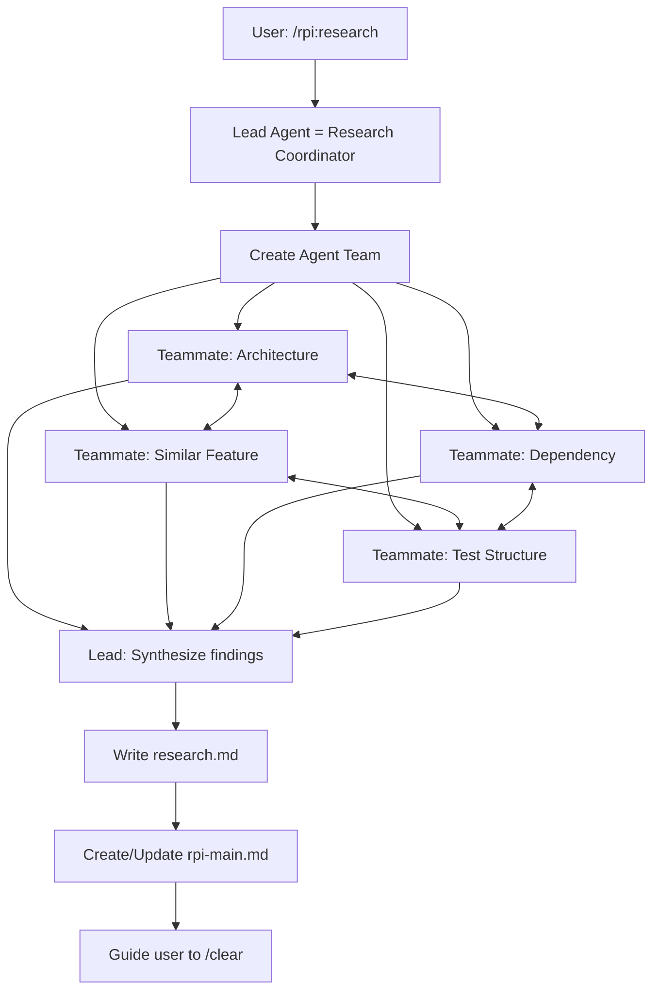
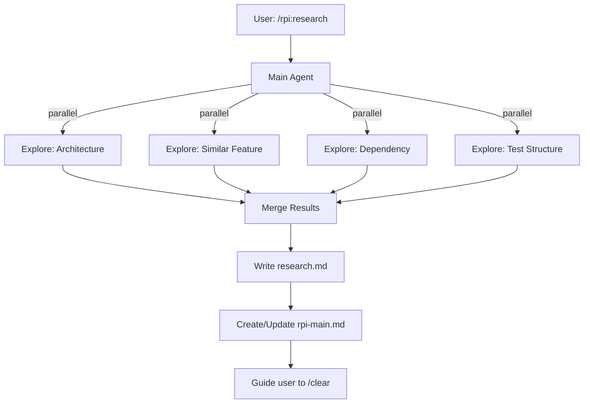

# RPI Research Phase

## Overview

Research is the first phase of the RPI workflow. Run 4 Explore Agents in parallel to gather comprehensive codebase context.

**Goal**: Understand the codebase thoroughly before planning implementation.

## When to Use

- Starting a new feature implementation
- Beginning a bug fix that requires understanding existing code
- Before refactoring work
- When unfamiliar with an area of the codebase

## Rule Loading

Before launching Explore Agents, check for project-specific rules:

```
<project>/.claude/rules/
├── architecture.md   → Architecture Agent
├── patterns.md       → Similar Feature Agent
├── dependencies.md   → Dependency Agent
└── testing.md        → Test Structure Agent
```

**How to load:**
1. Detect project root (git root or current directory)
2. Check if rule file exists at `<project>/.claude/rules/[type].md`
3. If exists, append rule content to agent prompt

**Create rules with:** `/rpi:rule add [type]`

## Execution Mode

Check environment variable `CLAUDE_CODE_EXPERIMENTAL_AGENT_TEAMS`:

- **Set to `1`** → Use **Agent Teams Mode** (teammates with direct communication)
- **Not set** → Use **Classic Mode** (Task tool sub-agents)

---

## Agent Teams Mode

> Requires: `CLAUDE_CODE_EXPERIMENTAL_AGENT_TEAMS=1` in `.claude/settings.local.json`

### Workflow



### Team Creation Prompt

Tell Claude to create an agent team with this structure:

```
Create an agent team to research [feature] implementation in this codebase.

Team structure:
- Architecture Teammate: Explore project layer structure, module patterns,
  directory organization, and key conventions.
- Similar Feature Teammate: Find existing code similar to [feature],
  reference implementations, and patterns to follow.
- Dependency Teammate: Map files needing modification, import chains,
  and impact scope for [feature].
- Test Structure Teammate: Analyze test file locations, testing framework,
  mock patterns, and fixtures used in this project.

Coordination rules:
1. Architecture Teammate should share structural findings early — other
   teammates should reference these to focus their exploration.
2. Similar Feature Teammate should share reference file paths with
   Dependency Teammate to help map impact scope.
3. All teammates: read-only exploration. Do NOT modify any files.
4. Each teammate reports findings to the shared task list when done.
```

### Teammate Prompts

**Architecture Teammate:**
```
You are the Architecture Teammate for researching [feature].
Explore the codebase architecture:
- Layer/module structure
- Key patterns and conventions
- Directory organization

IMPORTANT: Share your findings with the team as you discover them.
Other teammates will use your structural insights to focus their work.

Return: Architecture summary with key file paths

[If .claude/rules/architecture.md exists, append:]
Project Rules:
[rule content]
```

**Similar Feature Teammate:**
```
You are the Similar Feature Teammate for researching [feature].
Find existing code similar to [feature]:
- Similar features already implemented
- Patterns used in comparable functionality
- Reference files to follow

IMPORTANT: Check Architecture teammate's findings for layer structure
before exploring. Share reference file paths with Dependency teammate.

Return: List of reference files with pattern notes

[If .claude/rules/patterns.md exists, append:]
Project Rules:
[rule content]
```

**Dependency Teammate:**
```
You are the Dependency Teammate for researching [feature].
Analyze dependencies:
- Files that will need modification
- Import chains and dependencies
- Potential impact scope

IMPORTANT: Reference Architecture teammate's layer structure and
Similar Feature teammate's file paths to map dependencies accurately.

Return: Affected files list with change types

[If .claude/rules/dependencies.md exists, append:]
Project Rules:
[rule content]
```

**Test Structure Teammate:**
```
You are the Test Structure Teammate for researching [feature].
Analyze test structure:
- Test file locations and naming
- Testing framework used
- Mock patterns and fixtures

IMPORTANT: Use Architecture teammate's directory structure to locate
test directories. Reference Similar Feature teammate's patterns for
test examples.

Return: Test patterns with examples

[If .claude/rules/testing.md exists, append:]
Project Rules:
[rule content]
```

### Lead Agent Responsibilities

After teammates complete their work:

1. Review all teammate findings from the shared task list
2. Synthesize cross-references (e.g., Architecture found MVVM → Similar Feature found MVVM examples → Dependency mapped MVVM file impacts)
3. Write research.md using the template
4. Create/update rpi-main.md
5. Guide user to `/clear`

### Agent Teams Mode Advantages

- Teammates cross-reference findings in real-time
- Architecture discoveries immediately inform other teammates' search focus
- Lead agent context stays clean (no 4-result merge burden)
- Higher quality research through coordinated exploration

---

## Classic Mode

> Default when `CLAUDE_CODE_EXPERIMENTAL_AGENT_TEAMS` is not set.

### Workflow



### Parallel Agents

Launch these 4 Explore Agents in a **single message** (critical for parallelism):

| Agent | Role | What to Look For |
|-------|------|------------------|
| Architecture | Project structure, layer patterns | Layers, modules, conventions |
| Similar Feature | Find similar existing code | Reference implementations, patterns to follow |
| Dependency | Track change impact scope | What files will be affected |
| Test Structure | Understand test conventions | Test patterns, naming, frameworks used |

### Agent Prompts

**Architecture Agent:**
```
Explore the codebase architecture for implementing [feature].
Find:
- Layer/module structure
- Key patterns and conventions
- Directory organization
Return: Architecture summary with key file paths

[If .claude/rules/architecture.md exists, append:]
Project Rules:
[rule content]
```

**Similar Feature Agent:**
```
Find existing code similar to [feature].
Look for:
- Similar features already implemented
- Patterns used in comparable functionality
- Reference files to follow
Return: List of reference files with pattern notes

[If .claude/rules/patterns.md exists, append:]
Project Rules:
[rule content]
```

**Dependency Agent:**
```
Analyze dependencies for [feature].
Identify:
- Files that will need modification
- Import chains and dependencies
- Potential impact scope
Return: Affected files list with change types

[If .claude/rules/dependencies.md exists, append:]
Project Rules:
[rule content]
```

**Test Structure Agent:**
```
Analyze test structure for [feature] area.
Find:
- Test file locations and naming
- Testing framework used
- Mock patterns and fixtures
Return: Test patterns with examples

[If .claude/rules/testing.md exists, append:]
Project Rules:
[rule content]
```

---

## Output Files

### 1. research.md

Location: `docs/research/[branch-name]/YYYY-MM-DD-[feature]-research.md`

Use template: `~/.claude/rpi/research-template.md`

Must include:
- Executive Summary
- Results from all 4 agents
- Relevant files (core + reference)
- Existing patterns
- Dependencies
- Impact analysis
- Constraints discovered
- Open questions

### 2. rpi-main.md

Location: `docs/rpi/[branch-name]/rpi-main.md`

Use template: `~/.claude/rpi/rpi-main-template.md`

Create or update with:
- Current Session: Plan (next phase)
- Research document: Complete
- Execution mode used (Agent Teams / Classic)
- Session history entry

## Exit Conditions

Before guiding user to `/clear`:

- [ ] research.md complete with all 4 agent outputs
- [ ] rpi-main.md created/updated
- [ ] Open questions listed (if any)
- [ ] User informed about next step: `/clear` then `/rpi:plan`

## Exit Message Template

```
Research phase complete.

Mode: [Agent Teams / Classic]

Documents created:
- `docs/research/[branch]/[date]-[feature]-research.md`
- `docs/rpi/[branch]/rpi-main.md`

Next steps:
1. Run `/clear` to start fresh session
2. Run `/rpi:plan` with: `@docs/research/[branch]/...-research.md`
```

## Red Flags - STOP

- Attempting to plan without completing research
- Skipping any of the 4 Explore agents/teammates
- **Classic Mode**: Not running agents in parallel (must be single message)
- **Agent Teams Mode**: Not creating a proper team (must use agent team, not individual Task calls)
- Forgetting to create rpi-main.md
- Not guiding user to `/clear`
- Teammates modifying files (research is READ-ONLY)
