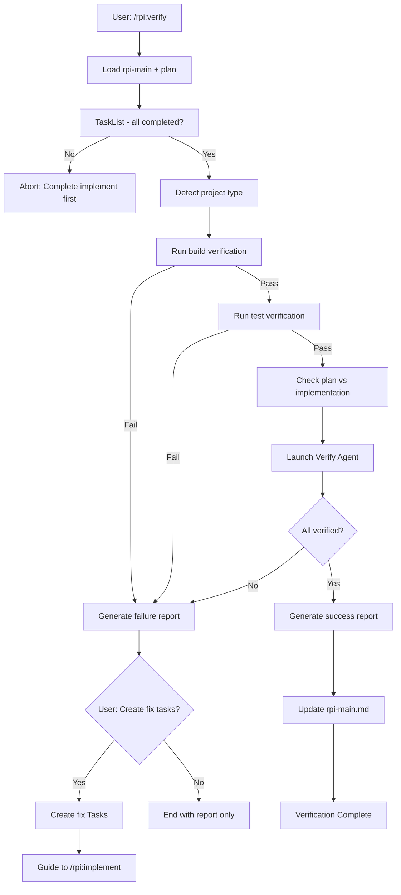

# RPI Verify Phase

## Overview

Verify is the fourth and final phase of the RPI workflow. Validate that implementation matches the plan, build succeeds, and all tests pass.

**Goal**: Ensure implementation completeness before considering the feature done.

## Prerequisites

- Implement phase must be complete
- All Tasks should be `completed` status
- `CLAUDE_CODE_TASK_LIST_ID` should be set

## Rule Loading

No rules to load - reference plan.md and research.md only

## Input

- `@docs/rpi/[branch]/rpi-main.md` (status check)
- `@docs/plans/[branch]/...-plan.md` (implementation checklist)
- `@docs/research/[branch]/...-research.md` (original requirements)
- **`TaskList`** (completion status)

## Workflow



## Verification Steps

### 1. Task Completion Check

```
TaskList - verify ALL tasks are status: completed
```

If any task is not completed, abort verification and guide user to complete implementation first.

### 2. Project Type Detection

Detect project type from files in root directory:

| File Found | Project Type | Build Command | Test Command |
|------------|--------------|---------------|--------------|
| `Package.swift` | Swift Package | `swift build` | `swift test` |
| `*.xcodeproj` or `*.xcworkspace` | iOS/macOS | `xcodebuild build` | `xcodebuild test` |
| `package.json` | Node.js | `npm run build` | `npm test` |
| `Cargo.toml` | Rust | `cargo build` | `cargo test` |
| `go.mod` | Go | `go build ./...` | `go test ./...` |
| `pom.xml` | Java (Maven) | `mvn compile` | `mvn test` |
| `build.gradle` | Java/Kotlin (Gradle) | `./gradlew build` | `./gradlew test` |
| `requirements.txt` or `pyproject.toml` | Python | `python -m py_compile` | `pytest` |
| `Gemfile` | Ruby | `bundle install` | `bundle exec rspec` |
| `Makefile` | Generic | `make` | `make test` |

**Priority**: If multiple files exist, use the most specific (e.g., prefer `Package.swift` over `Makefile`).

**Override**: If `research.md` specifies custom build/test commands, use those instead.

### 3. Build Verification

Run detected or configured build command:

```bash
# Use detected command from step 2
# Or use project-specific command from research.md

# Examples:
# Swift Package: swift build
# iOS/macOS: xcodebuild -scheme [Scheme] -destination '[dest]' build
# Node.js: npm run build
# Rust: cargo build
# Go: go build ./...
```

Capture build output. If build fails, proceed to report generation.

### 4. Test Verification

Run detected or configured test command:

```bash
# Use detected command from step 2
# Or use project-specific command from research.md

# Examples:
# Swift Package: swift test
# iOS/macOS: xcodebuild test -scheme [Scheme] -destination '[dest]'
# Node.js: npm test
# Rust: cargo test
# Go: go test ./...
```

Capture test output. If tests fail, proceed to report generation.

### 5. Plan vs Implementation Check

Launch a Verify Agent to check plan.md against actual implementation:

```
Task(subagent_type="Explore", prompt="""
Verify implementation against plan.

Plan: @docs/plans/[branch]/...-plan.md

For EACH Step in the plan:
1. Check if the specified file exists
2. Verify the changes described were implemented
3. Check if verification criteria are met

Return:
- Step N: [PASS/FAIL] - [details]
- Missing implementations (if any)
- Extra changes not in plan (if any)
""")
```

## Output Files

### 1. verify-report.md

Location: `docs/verify/[branch-name]/YYYY-MM-DD-[feature]-verify.md`

**Success Report:**
```markdown
# Verification Report: [Feature Name]

> **Date**: YYYY-MM-DD
> **Status**: ✅ PASSED
> **Branch**: [branch-name]

## Summary

All verifications passed.

## Build Verification
- **Status**: ✅ PASSED
- **Command**: `[detected or configured build command]`
- **Duration**: X seconds

## Test Verification
- **Status**: ✅ PASSED
- **Tests Run**: N
- **Tests Passed**: N
- **Coverage**: X% (if available)

## Plan Implementation Check

| Step | File | Status | Notes |
|------|------|--------|-------|
| 1 | path/to/file | ✅ | Implemented as planned |
| 2 | path/to/file | ✅ | Implemented as planned |
| ... | ... | ... | ... |

## Conclusion

Implementation verified successfully. Ready for:
- [ ] Code review
- [ ] PR creation
- [ ] Merge to main
```

**Failure Report:**
```markdown
# Verification Report: [Feature Name]

> **Date**: YYYY-MM-DD
> **Status**: ❌ FAILED
> **Branch**: [branch-name]

## Summary

Verification failed. Issues found: N

## Build Verification
- **Status**: ✅ PASSED / ❌ FAILED
- **Error** (if failed):
```
[build error output]
```

## Test Verification
- **Status**: ✅ PASSED / ❌ FAILED
- **Failed Tests** (if any):
  - `TestClassName.testMethodName`: [error message]

## Plan Implementation Check

| Step | File | Status | Notes |
|------|------|--------|-------|
| 1 | path/to/file | ✅ | OK |
| 2 | path/to/file | ❌ | Missing: [what's missing] |
| ... | ... | ... | ... |

## Issues Found

### Issue 1: [Issue Title]
- **Type**: Build Error / Test Failure / Missing Implementation
- **Location**: [file:line or step reference]
- **Description**: [what's wrong]
- **Suggested Fix**: [how to fix]

### Issue 2: [Issue Title]
...

## Recommended Fix Tasks

1. **Fix: [Issue 1 Title]**
   - File: path/to/file
   - Action: [what to do]

2. **Fix: [Issue 2 Title]**
   - File: path/to/file
   - Action: [what to do]
```

### 2. Update rpi-main.md

Add verification entry to Session History:
```markdown
| Verify | YYYY-MM-DD HH:MM | YYYY-MM-DD HH:MM | PASSED / FAILED (N issues) |
```

Update Current Session:
- PASSED: `Current Session: Complete`
- FAILED: `Current Session: Implement (fix required)`

## Fix Task Creation

If verification failed and user approves fix task creation:

```
For each issue in the report:

TaskCreate:
  subject: "Fix: [Issue Title]"
  description: |
    Issue Type: [Build Error / Test Failure / Missing Implementation]
    Location: [file or step]
    Problem: [description]
    Suggested Fix: [how to fix]
    Verification: Re-run /rpi:verify after fix
  activeForm: "Fixing [Issue Title]"
  metadata: { "type": "fix", "source": "verify" }
```

## User Approval Flow

After generating failure report, use `AskUserQuestion`:

```
Verification failed with N issues.

Report: docs/verify/[branch]/...-verify.md

Options:
1. Create fix Tasks and run /rpi:implement
2. Review report only (manual fix)
3. Abort (issues are acceptable)
```

## Exit Conditions

### Success Exit

```
Verification PASSED ✅

All checks completed:
- Build: ✅
- Tests: ✅
- Plan Implementation: ✅

Report: `docs/verify/[branch]/[date]-[feature]-verify.md`

Updated: `docs/rpi/[branch]/rpi-main.md` (Status: Complete)

Next steps:
1. Create PR or merge
2. Archive RPI documents if desired
```

### Failure Exit (with fix tasks)

```
Verification FAILED ❌

Issues found: N
- Build errors: X
- Test failures: Y
- Missing implementations: Z

Report: `docs/verify/[branch]/[date]-[feature]-verify.md`

Fix Tasks created: M tasks

Next steps:
1. Run `/clear` to start fresh session
2. Run `/rpi:implement` to fix issues
3. Run `/rpi:verify` again after fixes
```

### Failure Exit (report only)

```
Verification FAILED ❌

Issues found: N

Report: `docs/verify/[branch]/[date]-[feature]-verify.md`

No fix tasks created. Review the report and fix manually.
```

## Red Flags - STOP

- Running verify before all Tasks are completed
- Skipping build or test verification
- Not checking plan vs implementation
- Creating fix tasks without user approval
- Not generating verification report
